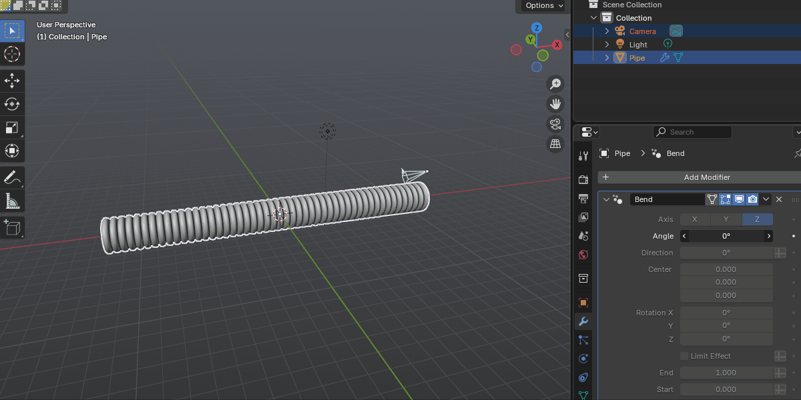

.. Bend Modifier documentation master file, created by
   sphinx-quickstart on Wed Sep 10 16:20:52 2025.
   You can adapt this file completely to your liking, but it should at least
   contain the root `toctree` directive.

.. Fit Curve documentation master file, created by
   sphinx-quickstart on Mon Feb 17 13:16:15 2025.
   You can adapt this file completely to your liking, but it should at least
   contain the root `toctree` directive.

---------------------------------
What is the Bend Modifier?
---------------------------------

The `Bend Modifier <https://blendermarket.com/products/bend-modifier/?ref=361>`_ is a Blender modifier designed to provide an intuitive alternative to Blender’s built-in option. 

Blender’s built-in Simple Deform offers a bend mode, but it’s awkward as it requires 'Empty' objects for placement and takes some time to set up. This add-on gives you a dedicated Bend Modifier asset that’s:

#. Easier to use,
#. Gizmo-driven,
#. Non-destructive,
#. Fully compatible with other modifiers, and
#. Kind to your UVs.

---------------------------------
How It Works
---------------------------------

Follow the :ref:`How to Use<quick_start>` guide. Essentially:

#. **Save the Bend Modifier .blend file** to Your Asset Library  - Set the .blend file asset directory to use it in any Blender project under Edit -> Preferences -> File Paths.
#. **Add the Modifier**: Select an object and go to *Deform - Bend* from the modifier panel.
#. **Fine-Tune** the modifier's ::ref:`parameters<parameter_reference>`.

---------------------------------
Contents
---------------------------------

.. toctree::
   :maxdepth: 1
   :caption: Contents:
   
   installation
   quick_start
   troubleshooting
   contact