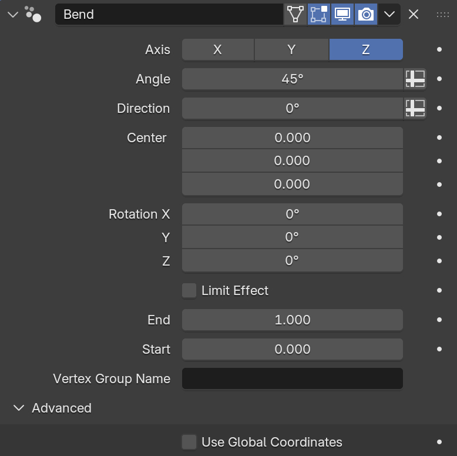

.. _quick_start:

Quick Start
===========

This page shows how to install and use the **Bend** modifier.

Requirements
------------

- Blender 4.5+ (tested with latest).
- The *Bend* asset :ref:`installed<installation>`.

Install
-------

Follow the steps in :ref:`Installation<installation>` to set up the asset in your Blender Asset Library.

Add the Modifier
----------------

1. Select any mesh object.
2. Open the :guilabel:`Modifiers` tab.
3. Click :guilabel:`Add Modifier` → :guilabel:`Deform` → **Bend**.

Basic Use
---------

1. **Choose Axis** — Pick **X**, **Y** or **Z** under *Axis*.
   This is the bend **axis** (the hinge the bend rotates around).

2. **Set Angle** — Use *Angle* to define the total bend (e.g. ``90°`` for a quarter circle).

3. **Aim the Bend** — Use *Direction* (in degrees) to rotate the bend plane *around* the chosen axis.

4. **Place the Pivot** — Set *Center* (X/Y/Z) to position the bend’s origin, or simply drag the built-in gizmo.

5. *(Optional)* **Rotate the Gizmo Frame** — *Rotation X/Y/Z* rotates the bend frame relative to the object (handy when your object space isn’t aligned to where you want the bend).

    .. image:: _static/images/bend_modifier_rotate_gizmo.gif
      :alt: Rotation Controls

6. *(Optional)* - **Limit Effect** — Restricts the bend to a portion of the object along the chosen axis.  When enabled, set **Start** and **End** distances to define the limit window either on the modifier panel or by dragging the gizmo handles that appear.

    .. image:: _static/images/bend_modifier_limit_effect.gif
        :alt: Limit Effect

    * **Start** and **End** are distances (in object units) measured along the bend’s **along-direction** from the *Center*. Inside this window the mesh follows a circular arc.   
    * ``Start`` is negative, ``End`` must be positive.
    * Outside the limit, the mesh continues **straight** along the correct end tangents (no kink).
        
7. *(Optional)* **Vertex Group** — Enter a *Vertex Group Name* to weight the effect (0..1) across the mesh.

Using the Gizmo
----------------

- **Move** the gizmo to reposition *Center*.
- **Rotate** the gizmo around the *Axis* to change *Direction*.
- **Rotate** around the other axes to reorient the along-direction if needed.

Thee gizmo changes the modifier parameters directly, so you can also type values in the panel.

.. _parameter_reference:

Parameter Reference
-------------------

* **Axis (X/Y/Z)**  

  Bend **axis** (the hinge). The mesh bends around this vector.

* **Angle**

  Total bend angle in degrees across the limited region (or entire mesh if not limited).

* **Direction**

  Rotates the bend plane around the chosen *Axis*.

* **Center (X, Y, Z)**

  World-space location of the bend’s origin (also controlled by the gizmo).

* **Rotation X/Y/Z**

  Rotates the bend frame relative to the object. Use if your object’s orientation is awkward.

* **Limit Effect**

When enabled, only geometry along the distance between **Start** and **End** is bent into the arc. 
    * **Start, End**
        Define the limit window along the chosen axis. ``Start`` travels along the negative axis line, ``End`` travels along the positive axis line.
        
* **Vertex Group Name**

  Optional weight mask; vertices with weight 0 are unaffected, weight 1 receive full bending.

