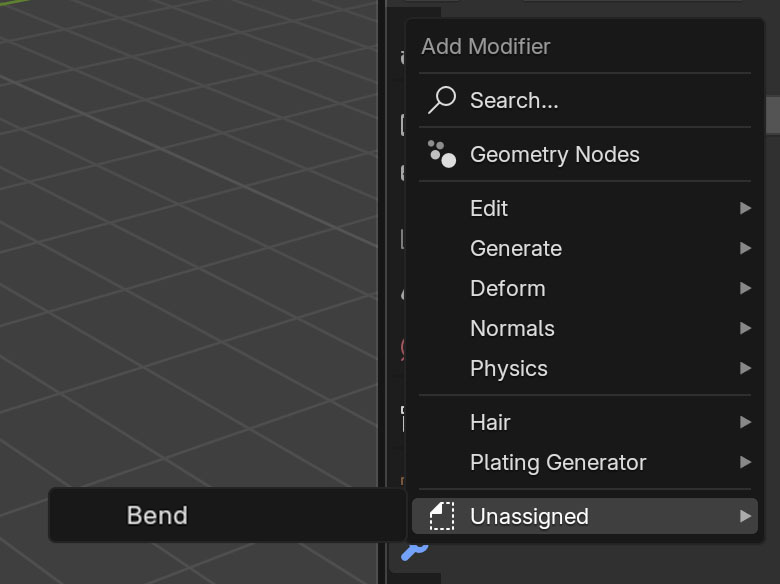
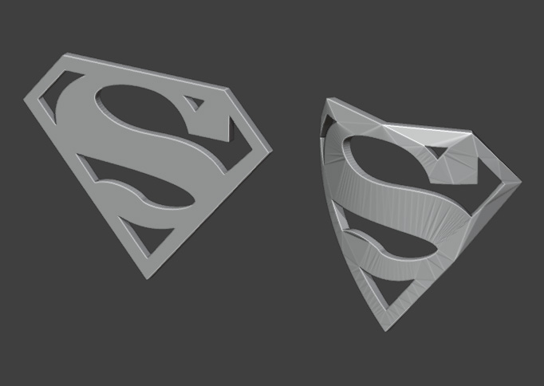
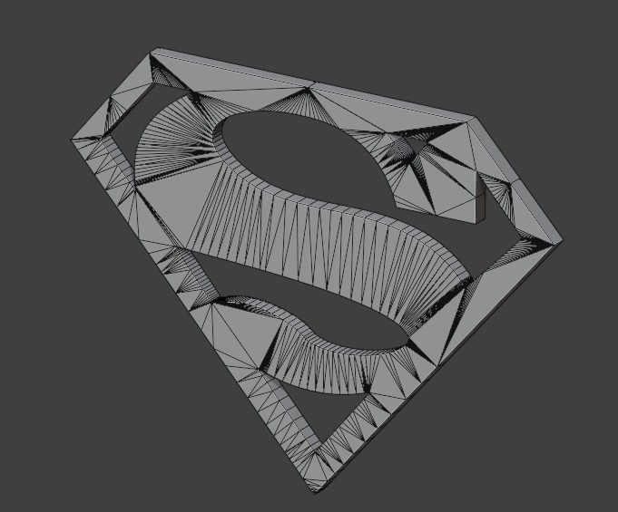
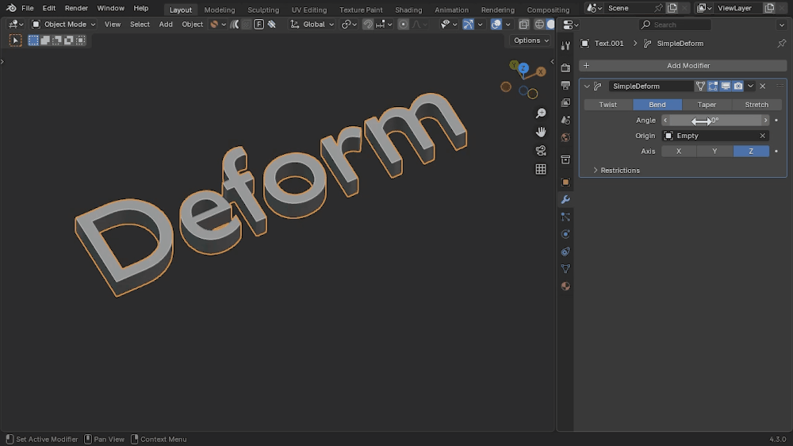
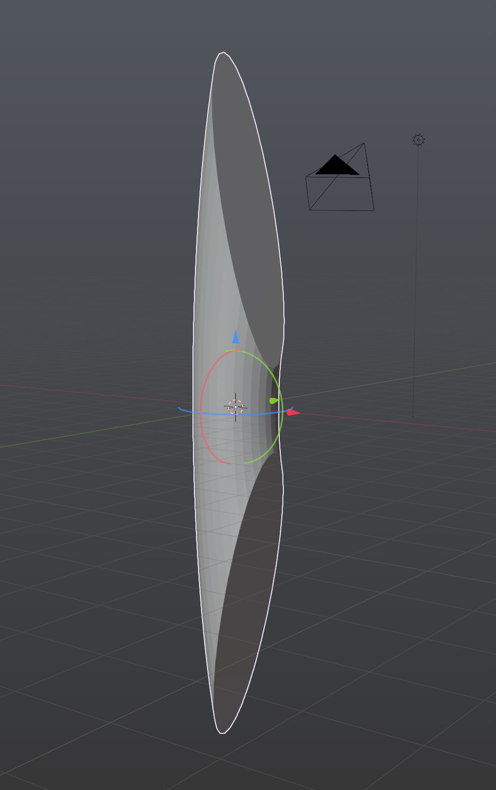
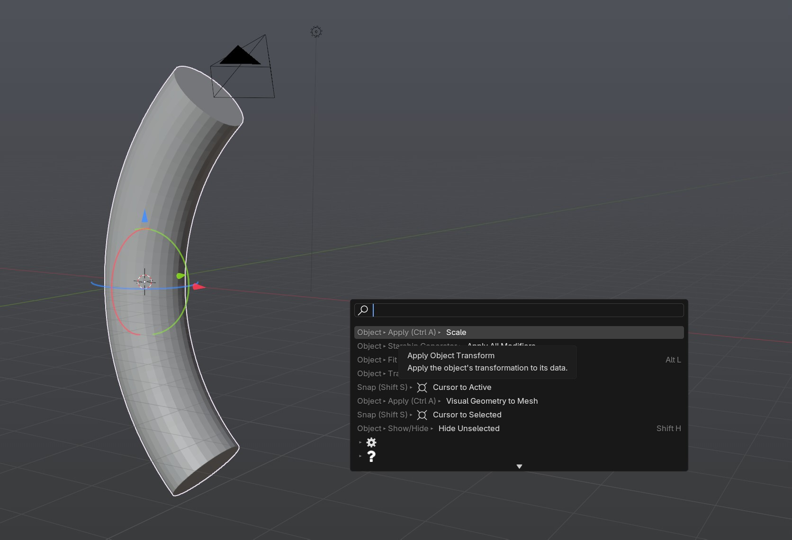

.. _troubleshooting:

#####################################
Tips and Troubleshooting
#####################################

.. note::
    
    If you are having any issues do not hesitate to :ref:`Contact Us <contact>`

--------------------------------------------------------------------------------------
The modifier does not appear to work or crashes Blender when I try to use it
--------------------------------------------------------------------------------------

This is likely due to the fact that the modifier is compatible with Blender 4.5 and above.  Make sure you are using the correct version of Blender and :ref:`Contact Us <contact>` if you are still having issues.

--------------------------------------------------------------------------------------
The modifier appears in the *Unassigned* category instead of *Deform*
--------------------------------------------------------------------------------------

By default, Blender does not categorize custom modifier assets automatically. If the *Bend Modifier* appears in the **Unassigned** category instead of **Deform**, follow  :ref:`these steps<add_cat>` to manually set the correct category inside Blender.

--------------------------------------------------------------------------------------
The gizmo does not appear when I add the modifier
--------------------------------------------------------------------------------------

If the gizmo is not appearing, try the following steps:

1. Ensure the object is selected.
2. In the *modifiers* tab, make sure the *Bend* modifier is selected (highlighted in blue).
3. Check if the modifier is enabled in the modifier stack.
4. Make sure the 'Gizmo' option is checked in the viewport.

    .. image:: _static/images/gizmo_option.jpg
       :alt: Troubleshooting

--------------------------------------------------------------------------------------
When I bend an object, it only bends on one side.  How do I fix this?
--------------------------------------------------------------------------------------

Your *Limit Effect* may only cover one side. Make **Start** negative and **End** positive (e.g. ``-1.0`` to ``1.0``)to bend symmetrically around the center.

--------------------------------------------------------------------------------------
When I bend an object, it bends the "wrong" way.  How do I fix this?
--------------------------------------------------------------------------------------

Flip the sign of *Angle* or rotate *Direction* by ``180°``.

----------------------------------------------------------------------------------
When I bend an object, it can look distressed or triangulated.  Why?
----------------------------------------------------------------------------------

When you bend or stretch an 3D object, as with this *Bend Modifier*, the object's **topology** (or the edges and faces that make up the mesh) affects how well it deforms.

For best results, your object should have a **clean, evenly spaced, quad-based mesh**.

If your object is made of triangles or n-gons (faces with more than four sides), it may **bend strangely, stretch unevenly, or break apart.**

Quick Fix for Text & Logos
--------------------------

If you're trying to curve **text or a logo**, a fast way to improve the topology is:

#. Add a **Remesh Modifier** to your object.
#. Set it to **Sharp** mode.
#. **Untick** *Remove Disconnected* (so letters don’t merge).
#. Increase **Octree Depth** to add more detail.

.. warning::
   This method increases geometry, making your file heavier.

Better Long-Term Solutions
--------------------------

For **good deformations**, consider:

* **Manual Retopology** – Redrawing the mesh with nice, even quads. My other add-on, `Quad Maker <https://blendermarket.com/products/quad-maker?ref=361>`_, may help.  
* **Subdivision Modifier** – Adds more geometry for smoother bending.  
* **Remeshing in an External Program** – Software like Instant Meshes or RetopoFlow can help.  

With a good mesh, the *Bend* modifier will work much better.

--------------------------------------------------------------------------------------
When I bend an object, the result seems stretched.  How do I fix this?
--------------------------------------------------------------------------------------

When you scale the curve in regular object, it is stretching the curve's "global" coordinates which will also distort the mesh.

To fix this, you can apply the scale to the curve by selecting it, and under the *Object* viewport menu select *Apply -> Scale*:

--------------------------------------------------------------------------------------
A question or issue I have is not covered here.
--------------------------------------------------------------------------------------

Please do not hesitate to :ref:`Contact me <contact>` if you have any questions or issues.  I am here to help you get the most out of the *Bend Modifier*.